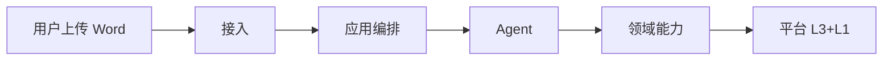
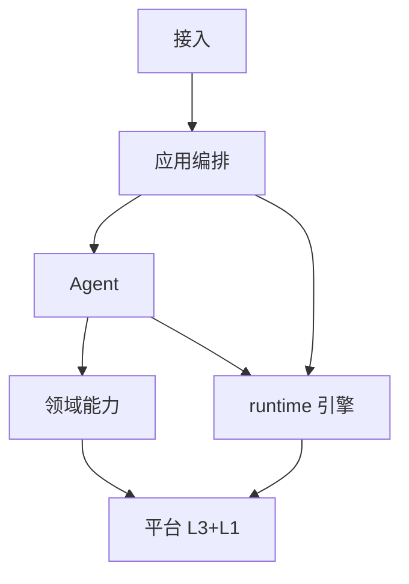
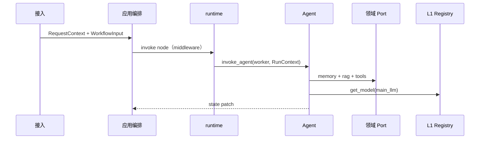

# 多 Agent 协作系统 — 总体架构设计

## 0. 方案总览（建议先读）

本节用**日常语言**说明「系统是什么、一次请求怎么走、各层干什么、能力怎么接、快的时候怎么并行」。第 1 节起为实施级细节；RAG / 记忆 / 工具的细节在三份子文档。

### 0.1 我们在建什么

一套**企业级多 Agent 底座**：业务场景可以后置（先做报告生成，再加问答、审批），但底座要先能：

- **换零件不影响业务** — 换向量库、换大模型供应商、换工作流引擎，不必重写「写章节」的逻辑。
- **分工清楚** — 检索、记忆、工具、技能、外部 MCP 各管一块，避免一个 `MainAgent.py` 越写越大。
- **能上线** — 有审计、脱敏、限流、降级；并行写报告时不会把 API 打挂。

可以把它想成：**上面是「剧本」（场景流程），中间是「演员」（Router/Worker 等角色），下面是「道具与后勤部门」（检索、记忆、工具等）**。

### 0.2 一次请求怎么走（以「生成工程报告」为例）



1. **用户**从 Web/API 上传文档并发起任务。  
2. **接入**做登录、限流，生成 `RequestContext`（一期可 CLI 省略独立 `api/`）。  
3. **应用编排**按场景 DAG 执行：解析 Word（**RAG 写入**，见 `RAG_DESIGN.md` §2）→ 大纲 → 规划章节 → **并行**写各章 → 合并；LangGraph 在 `runtime/` 实现。  
4. **Agent 角色**（Router / Worker）：思考、调 Port、写结果。  
5. **领域能力**：RAG（读 `RAGPort` + 写 `rag/ingest`）、记忆、工具、Skill、MCP。  
6. **平台**：L3 存储 Port + L1 `get_model`；Agent **不直接**连 Chroma 或 Redis。

**公文包 `RunContext`**：每次运行给角色一个包，里面装好本场景需要的能力接口（如 `rag`、`memory`、`tools`）和 `get_model("main_llm")`。**没有 Gateway** — 不是再套一层总机，而是按需把各部门电话簿塞进包里。

### 0.3 五层模型（对外只记这五块）

| 层 | 职责 | 代码大致在哪 |
|----|------|----------------|
| **接入** | 鉴权、限流、`RequestContext` | `api/`（一期可省略） |
| **应用编排** | 场景 DAG、并行 `Send`、HITL；**执行引擎**（LangGraph）在 `runtime/` | `workflows/` + `runtime/` |
| **Agent** | Router / Worker、ReAct | `agents/` |
| **领域能力** | Port：`RAGPort`、Memory、Tool…；**RAG 建库**在 `rag/ingest`、`rag/index`（写入管道，非独立「摄取层」） | `rag/`、`memory/`、`tools/`… |
| **平台** | **L1** 配置/模型/脱敏 + **L3** 存储 | `infrastructure/`、`model/`、`storage/` |

**记忆口诀**：**接入 → 编排 → Agent → Port**；**模型只走 L1 Registry**；**RAG 读写都在 `rag/`**。

> 旧 **八层**中的 **L2 摄取**、**L4 引擎** 已取消独立层号，见 **§3.1**。

### 0.4 五大能力（细节在三份子文档）

- **RAG** — 「去知识库里找依据」，返回带出处的事实包，不负责最终写作文（`RAG_DESIGN.md`）。  
- **记忆** — 「这个人之前说过什么、项目长期设定是什么」；分热记忆（少变）、冷档案（可搜索）、技能记忆、外部画像（`MEMORY_DESIGN.md`）。  
- **工具 Tool** — 读 Word、读 JSON、写结果等**本系统内**的确定性操作。  
- **技能 Skill** — 多步 SOP（先 A 工具再 B 工具），像编好的小剧本。  
- **MCP** — 连**外部**服务（文件、浏览器、企业系统等），进程隔离、要强管控。

角色代码里写 `ctx.rag...`、`ctx.tools...`，**不要** `import chromadb` 或具体工具文件。

### 0.5 写场景时的两条线：主路径 vs 场务

- **主路径（L7 节点里该写的）** — 业务步骤：解析文档、调 Router、并行写章、合并。  
- **场务（Middleware / Callback）** — 日志、耗时、追踪、脱敏、鉴权、审计、指标、重试策略。  

原则：**节点函数尽量短**；工程能力用包装器挂在节点和 LLM 链上（对齐现有 `middleware_log`、`callback_log`，迁到 `runtime/middleware` 与 `observability/callbacks`）。

### 0.6 想快的时候：三种「并行」（详见 9.7 节）

不要在一个节点里无限制开线程；分三种情况选：

1. **分多条流水线（首选）** — 10 个章节就发 10 路 `Send`，每路一个 Worker，各自有 `thread_id`，崩了一路不拖死全局。适合 L7 报告场景。  
2. **一批一单（省 API 次数）** — 多条检索/多条 embedding 合并成一次调用，在 **RAG / 模型** 部门内部批处理。  
3. **一个班组里几个人同时干（兜底）** — 一路 `Send` 里仍带 5 个小标题时，在 **L6 角色内部** 有限并行；上限由 `config/concurrency.yml` 和 Policy 控制。  

**Policy** 像「车间主任」：限制同时开几条线、每批多大，避免把大模型或向量库打满。

### 0.7 四份文档怎么读

1. **本文档 第 0 节** — 总览（你正在读）。  
2. **本文档 第 1.3～1.5 节** — 首期范围、MVP 能力矩阵、**已冻结的产品级决议**（落地前必读）。  
3. **本文档 第 2～3 节** — 依赖规则与**五层**职责（评审用）。  
4. **本文档 第 9 节** — 能力接入、场景编排、批处理与并发。  
5. **本文档 第 5、7.2、11～12、13、14、15、17 节** — 平台 Port、**RAGPort 接口**、脱敏、模型、目录、实施。  
6. **`RAG_DESIGN.md`** — RAG 写入/检索/Redis（§2～§17）；**`MEMORY_DESIGN.md` / `TOOLS_SKILLS_MCP_DESIGN.md`** — 记忆与工具。

### 0.8 建议落地顺序（人话版）

**原则：先竖切「报告生成」一条闭环，再铺全量 L1；不要按层把基建做满再碰业务。**

1. **竖切 MVP**（见 **1.3**、**15.1**）：`RequestContext`（简化 ACL）→ `RAGPort`（向量 + 可选 qc）→ `ToolPort` → 现有 LangGraph 迁入 `workflows/report_generation` + `RunContext`。  
2. **水电物业（可渐进）**：Config、ModelRegistry（`get_model` 唯一入口）、Observability 最小集；PrivacyPort 先做 **日志 mask**，存储/出域规则随 Memory/RAG 上线补齐。  
3. **RAG 子系统**：`rag/ingest`（写入）+ `RAGPort`（读取）；Router 输出 `retrieval_plan`。  
4. **编排 + 公文包**：`workflows/` + `runtime/` 封装 `Send`；**删除**节点内 `ThreadPoolExecutor`。  
5. **记忆与策略**：Memory `persist_turn` + 热记忆快照；PolicyPort 替换 `ConcurrencyController`。  
6. **后置**：Graph RAG、NL2SQL、MCP、Skill 自动提取、全量 Privacy 出域策略。

### 0.9 和当前代码的关系

仓库里仍是较集中的 `Agents/MainAgent.py`、`rag/vector_store.py` 等；上文描述的是**目标形态**。已有做法（`Send` 分批、`ThreadPoolExecutor` 写章、`retrieve_batched`）与目标一致的部分保留，逐步迁到对应层，避免在 L7 节点里长期堆线程池与日志。

| 现状 | 目标落点 | 迁移注意 |
|------|----------|----------|
| `Agents/MainAgent.py` 图 + 节点 | `workflows/report_generation/` + `runtime/adapters/langgraph/` | `GraphState` 字段映射为 `domain/` DTO；LangGraph 类型不得进入 `agents/roles` 签名 |
| `search_create_worker_node` + 线程池 | L6 `agents/roles/section_worker.py` | 与 L7 `Send` 二选一为主并行，避免双重重试 |
| `React_Agent.ConcurrencyController` | L1 `PolicyPort` + `config/concurrency.yml` | 删除全局可变 batch 单例 |
| `rag/rag_service.retrieve_batched_*` | `RAGPort.route_and_retrieve_batch` | 保持按段落 batch 语义，避免 N 次单条 RTT |
| `middleware_log` / `callback_log` | `runtime/middleware/`、`infrastructure/observability/callbacks/` | 迁完前勿在业务节点新增 `print`/裸 logger |
| 无 `ports/`、`composition/` | `ports/*.py` + `composition/factory.py` | 先适配现有类为 Port，再拆目录，防止 Agent 继续直连 SDK |

落地风险与评审清单见 **第 17 节**。

---

## 1. 目标与边界

### 1.1 建设目标

本系统面向**企业级多 Agent 协作**：具体业务场景（如工程报告生成、知识问答、流程审批）可后置，但技术底座必须先满足：

- **层间完全解耦**：上层只依赖下层 Port/Protocol；更换向量库、换 LLM 网关、换编排引擎时，不影响 Agent 角色定义与场景 DAG。
- **基础能力足够厚**：配置、密钥、观测、存储、模型等在**平台层**一次建设；领域能力只做 Port 组合。
- **领域边界清晰**：RAG 能力全部在 `rag/`；记忆在 `memory/`；工具在 `tools/` 等，避免「上帝模块」。

### 1.2 设计原则

- **依赖倒置**：`ports/` 定义契约，`*/adapters/` 实现；业务代码面向接口编程。
- **框架隔离**：LangGraph 仅出现在 `runtime/adapters/langgraph/`；LangChain 仅作链式组件，不承担全局状态机。
- **Port 注入、无 Gateway**：编排层 / Agent 经 `RunContext` 持有 `RAGPort`、`MemoryPort`、`ToolPort` 等；模型经 L1 `get_model(role)` 统一获取。禁止在业务代码 `import` 各领域 `adapters/`。
- **场景节点只写业务**：编排图节点表达「做什么」；日志、追踪、脱敏等一律经 **Middleware / Callback** 注入。
- **可观测与可降级**：每次模型调用、每次检索计划可审计；失败有明确降级路径；空检索须 `EvidenceBundle.empty` + `degraded_reason`（**ADR-3**），禁止无标记空结果误导用户。
- **脱敏默认开启**：日志、审计、缓存、持久化记忆以「不含明文敏感信息」为默认；出域（外部 LLM、第三方 MCP）前可配置二次脱敏。

### 1.3 范围

**在范围内**：分层架构、Port 契约、目录规范、ModelRegistry、与三份子文档的衔接。

**非目标（首期）**：完整 Web UI、全量 Graph 知识库生产就绪、所有业务场景工作流模板、多区域部署细则、MCP 生产级连接池、Skill 自动提取与审核流水线、NL2SQL 自然语言查库、全量 Privacy 出域策略（可按场景渐进）。

#### 1.3.1 MVP 能力矩阵（首期 vs 子文档）

子文档（`RAG_DESIGN.md` 等）描述**终态能力**；一期以本表为准，避免按子文档 Phase 5 提前开工。

| 能力 | 一期（MVP，报告生成竖切） | 二期 | 明确不做（首期） |
|------|---------------------------|------|------------------|
| **接入** | CLI / 单入口；简化 `RequestContext` | HTTP API + IdentityPort | 多区域网关 |
| **应用编排** | `workflows/report_generation` 自 `MainAgent` 迁移 | 第二场景模板 | 低代码编排 UI |
| **Agent** | Router + Worker（+ `section_worker`） | Reviewer、Specialist | Planner / DeepAgents 必选 |
| **RAG** | Vector + 可选 Redis `qc`/`emb`；`retrieval_plan.primary=vector` | 规则路由 + SQL 只读 | Graph RAG、qc 反向索引全量 |
| **记忆** | Hermes L1 快照 + 冷档案 `persist_turn`（SQLite） | `session_search`、HITL 写 USER | 外部画像、Skill 自动沉淀 |
| **Tool** | `ToolPort` 包装现有 `tools/*` + ACL | `invoke_batch` 只读 | 任意代码执行 Tool |
| **Skill / MCP** | 无（Router 不输出 skill 步骤） | 单 Skill 试点 | 多 MCP Server 池化 |
| **RAG 写入** | Word→JSON 经 **RAG `IngestPort`**（非 Agent Tool） | OCR/YOLO 可选 | 对话内随意触发 OCR Tool |
| **L1 Privacy** | 日志 `mask_text` + `args_hash` 审计 | 存储/出域/redact_for_llm | 全字段令牌化 |
| **L1 Policy** | `max_parallel_sends`、`batch_size` 配置化 | 动态 `suggest_batch_size` | — |
| **ModelRegistry** | `main_llm`、`router_llm`、`embedding`；禁止节点读 `rag.yml` 模型名 | rerank、fallback 链、熔断 | 未 bump `index_version` 换 embedding |

### 1.4 文档体系（四份）

- **本文档** — **§0 总览**；**§1.3～1.5** 范围/MVP/决议；**五层**模型 **§3**、依赖 **§2**；**RunContext**；编排/Agent **§8**；协作 **§9**；脱敏 **§11**；目录 **§14**
- `RAG_DESIGN.md` — RAG 写入/检索、Redis、路由与合规（主文档只保留 **RAGPort 接口**）
- `MEMORY_DESIGN.md` — Hermes 四层记忆、Session Archive、与 Checkpointer 分工
- `TOOLS_SKILLS_MCP_DESIGN.md` — Tool/Skill/MCP、文档摄取、OCR/YOLO

### 1.5 产品级决议（架构决策，变更须评审）

以下条目**冻结**，实现与子文档冲突时以本节为准；变更需更新四份文档对应章节。

| # | 议题 | 决议 |
|---|------|------|
| ADR-1 | **Skill 存放** | 运行时可执行 Skill **唯一目录**：`skills/published/`（`SkillPort` 只读）。Hermes L3 `skill_search` 索引同一目录或 LangGraph Store namespace `("skills", tenant_id)`。**禁止**在 `memory/skills/` 再维护第二份可执行全文；`memory/skills/` 仅允许放索引元数据（若需要）。 |
| ADR-2 | **文档摄取边界** | Word/PDF 入库走 **RAG 子系统 `IngestPort`**（`rag/ingest`），可复用 `read_word_2_json` 逻辑，**不**注册为 L6 默认可调 Tool。编排层节点 `ingest_document`（或 `call_port("ingest", ...)`）；禁止 Worker `ctx.tools.invoke("read_word_2_json")`。对话内 OCR 若要做，单独 Tool + ACL（见 `TOOLS_SKILLS_MCP_DESIGN.md` §10）。 |
| ADR-3 | **检索空结果** | 全部后端失败：`EvidenceBundle.empty=true` 且带 `degraded_reason`（枚举）与 **可审计错误码**；**禁止**无标记空列表。报告场景允许 Worker 在 `empty` 时回退**已 ACL 过滤的原文 excerpt**，须在 `observation` 写明 `degraded=true` 及原因，**禁止**无提示的空串章节。 |
| ADR-4 | **向量库与 PII** | 默认 **全文入库 + ACL**；高敏租户可入库前脱敏。qc/向量 metadata 细则见 **`RAG_DESIGN.md` §17**。 |
| ADR-5 | **Port 同步/异步** | `ports/` 契约以 **`async def` 为准**；编排 / Agent 节点为 **sync**。Adapter 提供 sync 包装，**禁止**在 `workflows/nodes.py` 散落 `create_task`。详见 **9.1.1**。 |
| ADR-6 | **工具路由风格** | 业务角色代码 **优先显式** `ctx.rag` / `ctx.tools`；ReAct 工具名路由（`mcp.` / `skill.` 前缀）仅在 `agents/react_loop.py` 或 `ToolPort.resolve` 一处实现，**禁止**再引入聚合 Gateway 类。 |
| ADR-7 | **`retrieval_plan` 归属** | **Router**（L6）结构化输出写入 state；**RAGPort** 只执行 plan，不二次「猜后端」。首期 plan 可写死 `{ "primary": "vector" }`，字段 schema 见 `RAG_DESIGN.md` 3.4。 |

---

## 2. 层间依赖规则

以下五条为**硬约束**；代码评审与架构评审均以此为准。

### 2.1 规则 1 — 单向依赖

**允许的依赖方向**

```
接入 → 应用编排 → Agent → 领域能力 → 平台（L3、L1）
应用编排 → runtime/（WorkflowRuntime 实现，非独立业务层）
领域能力 → L3、L1
rag/ingest、rag/index（RAG 写入）→ VectorPort（L3）、get_model（L1）
L3 → L1
```

（实现目录仍可用 `api/`、`workflows/`、`agents/` 等，与上表**五层**一一对应，见 §3。）

**禁止**

- `model/`、`storage/`、`infrastructure/` import `agents/`、`workflows/`、`rag/router/` 等上层模块。
- `ports/*.py` import `chromadb`、`redis`、`langgraph` 等 SDK（契约层保持纯净）。

### 2.2 规则 2 — 禁止跨层

- **向量检索** — 正确：L6 → `RAGPort` → VectorPort；错误：Worker 内 `Chroma.get_collection()`
- **会话缓存** — 正确：MemoryPort → CachePort；错误：Router 内 `redis.get()`
- **主对话模型** — 正确：注入 `get_model("main_llm")`；错误：节点内读 `rag.yml` 的 `chat_model_name`
- **并行子任务** — 正确：编排层 → `WorkflowRuntime` Send（`runtime/`）；错误：Worker 自建线程池绕过编排引擎

编排层 / Agent **永远**不感知 Chroma collection 名、Redis key 前缀、HTTP 网关 URL。

### 2.3 规则 3 — 接口与实现分离

- **`domain/`**：`RequestContext`、`EvidenceBundle` 等；禁止 `import langchain`。
- **`ports/`**：`RAGPort`、`WorkflowRuntime`、`CachePort` 等 Protocol。
- **实现位置**：`rag/adapters/`、`memory/adapters/`、`storage/adapters/`、`runtime/adapters/langgraph/`。

同一 Port 可有多个 Adapter（如 VectorPort：Chroma / Milvus），由配置切换，L5 无感。

### 2.4 规则 4 — 执行引擎可替换

**执行引擎**归属**应用编排**（`runtime/`），不是与场景并列的独立「第 N 层」。编排层依赖的接口示例（概念）：

- `WorkflowRuntime.compile(workflow_def) -> Runnable`
- `WorkflowRuntime.invoke(ctx, input) -> WorkflowResult`
- `StateStore.save_checkpoint(thread_id, state)` / `load_checkpoint`

LangGraph 的 `StateGraph`、`Send`、`Checkpointer` 全部封装在 `runtime/adapters/langgraph/`，不得泄漏到 `agents/roles/` 的类型注解中（可用 `Any` 或领域 DTO 代替）。

### 2.5 规则 5 — 基础能力先行

上线任一场景前，检查清单（**一期以 1.3.1 MVP 为准**）：

- **平台 L1**：Config / Observability / ModelRegistry；Privacy（至少日志 mask）按场景需要
- **平台 L3**：本场景 Storage Port（报告 MVP：Vector + 可选 Cache）
- **领域能力**：Domain Port 已注入 `RunContext`（报告 MVP：RAG + Tool）；若需建库则 RAG **IngestPort / IndexPort** 可用（`RAG_DESIGN.md` §2）
- **应用编排**：`WorkflowRuntime` 可 `invoke`（`runtime/`）；并行 Send 的 payload 已文档化

**禁止**将「临时 HTTP 调网关」留在 Agent 节点作为正式方案。

---

## 3. 分层总览（五层）

| 层 | 职责摘要 | 主要目录 |
|----|----------|----------|
| **接入** | 协议、鉴权、限流、`RequestContext` | `api/` |
| **应用编排** | 场景 DAG、调度 Agent/Port、HITL；**WorkflowRuntime**、Checkpointer 在 `runtime/` | `workflows/`、`runtime/` |
| **Agent** | 角色与 ReAct；不定义跨场景顺序 | `agents/` |
| **领域能力** | `RAGPort`、`MemoryPort`、`ToolPort`…；**RAG 写入**在 `rag/ingest`、`rag/index` | `rag/`、`memory/`、`tools/`… |
| **平台** | **L1** 横切服务 + **L3** 存储 Port | `infrastructure/`、`model/`、`storage/` |



### 3.1 旧八层对照（阅读旧资料时用）

| 已取消的独立层号 | 现归属 |
|------------------|--------|
| **L2 摄取与索引** | **RAG 子系统 · 写入管道**（`rag/ingest`、`rag/index`），见 `RAG_DESIGN.md` §2 |
| **L4 执行引擎** | **应用编排**的实现（`runtime/adapters/langgraph/` 等） |
| L8 / L7 / L6 / L5 | 接入 / 应用编排 / Agent / 领域能力 |
| L3 / L1 | 平台（存储 / 基础设施） |

---

## 4. 平台层 · 基础设施（L1）

L1 为全栈**横切基础服务**；所有层通过 Port 或 Registry 使用，禁止在业务模块散落读配置与密钥。

### 4.1 ConfigPort

- 统一加载 `config/models.yml`、`rag.yml`、`chroma.yml`、`tools.yml`、`mcp_servers.yml` 等。
- 支持环境覆盖（如 `RAG_API_KEY` 覆盖 yaml 中的引用名）。
- 提供类型化视图（如 `RagConfig`、`ChromaRetrievalConfig`），避免字典裸传。

### 4.2 SecretPort

- 解析 `api_key_env`、密钥服务路径；**禁止**将 JWT/密钥写入仓库。
- 日志与异常栈中**永不输出**完整 api_key；错误信息经 **PrivacyPort** 脱敏后再返回 L8。

### 4.3 PrivacyPort（脱敏统一入口）

脱敏能力集中在 L1，各层**禁止**各自实现一套正则替换。

- **`mask_text(text, policy) -> str`** — 展示/日志用：手机号、邮箱、身份证、银行卡等按规则掩码（如 `138****8000`）。
- **`redact_for_storage(record) -> record`** — 入库前：RAG ingest 文档块、Memory `persist_turn`、Relational 敏感列。
- **`redact_for_llm(messages, policy) -> messages`** — 出域前：可选对 user 输入做实体掩码（企业场景对「上传合同」常关闭，对「对话里随口报的身份证」开启）。
- **`hash_for_audit(value) -> str`** — 审计专用：工具参数、查询文本只存 hash（对应 `ToolInvocation.args_hash`、Redis `query_hash`）。
- **`classify_sensitivity(text) -> level`** — `public` / `internal` / `pii` / `secret`；驱动缓存 TTL、是否允许进 qc、是否允许送外部 MCP。

配置：`config/privacy.yml` 或 `infrastructure/privacy/redaction_rules.yml`（按租户可覆盖）。

### 4.4 ObservabilityPort

- 自接入层注入 `trace_id`，在领域 Port 检索、L1 模型调用、编排图节点间传递。
- 结构化字段：`layer`, `port`, `role`, `latency_ms`, `degraded`, `retrieval_plan`；**禁止**字段中出现完整用户正文、tool 参数 JSON。
- 写入日志前统一经 **PrivacyPort.mask_text**；与 `Agents/callback_log` 对齐，迁入 `infrastructure/observability/`。

### 4.5 IdentityPort

- 解析并校验 `tenant_id`、`user_id`。
- 产出 `acl`：可访问文档集合、可用工具列表、可用 MCP Server 列表。

### 4.6 PolicyPort

- 租户级 QPS、Token 预算、**并发 Worker 上限**（`max_parallel_sends`、`max_intra_batch_workers`）。
- **动态批大小**：可按章节数、系统负载或下游错误率调整 `batch_size`（替代散落在图节点内的 `ConcurrencyController`；配置见 `config/concurrency.yml`）。
- Tool/MCP/RAG 调用前校验；拒绝时返回标准错误码，不进模型。

### 4.7 ModelRegistry

- 统一 `get_model(role)`；详见 **第 13 节**。
- 与业务 Port 分离：RAGPort **使用** embedding/rerank，不**实现** HTTP 客户端。

### 4.8 目录与约束

- `infrastructure/` — Config、Secret、**Privacy**、Observability、Identity、Policy 实现。
- `model/` — Registry、providers、resilience。
- `config/` — YAML 配置源。
- **L1 不得依赖** `agents/`、`workflows/`、`rag/router/` 等上层；`model/providers/` 不得 import `rag/`、`agents/`。

---

## 5. 平台层 · 存储（L3）

L3 封装**持久化与缓存**；契约在 `ports/storage/`，实现在 `storage/adapters/`。**Agent / 编排只经领域 Port 间接使用 L3**，禁止直连 SDK。

| Port | 抽象能力（与领域无关） |
|------|------------------------|
| **CachePort** | get / set / delete / expire；租户键前缀 |
| **RelationalPort** | 事务、CRUD、outbox（异步任务） |
| **VectorPort** | upsert、similarity_search、delete_by_doc_id |
| **GraphPort** | 子图查询、路径导出文本 |
| **ObjectStorePort** | 存取二进制；返回 URI 引用 |

**领域对 L3 的用法**（键空间、TTL、索引版本、合规）不在此展开：

- **RAG** → `RAG_DESIGN.md` **§3、§4**
- **记忆** → `MEMORY_DESIGN.md` **§9**

**依赖**：L3 仅依赖 L1（Config、Observability、租户键策略）。

---

## 7. 领域能力层

领域能力是 Agent 的**唯一业务入口**（Port）；接口不依赖 LangGraph，实现在 `rag/`、`memory/`、`tools/` 等目录的 `adapters/`。

### 7.1 Port 装配与 RunContext（无 Gateway）

L5 对上仍是五个 **Port 契约**（`ports/` 中各自 Protocol），**不**再提供聚合网关类。组合根在 `composition/factory.py`（或 L8 `api/app_factory`）中实例化各 `*/adapters/`，按场景与角色**显式注入**。

**RunContext**（`composition/run_context.py`，一次 invoke 生命周期内只读传递）典型字段：

- `request: RequestContext`
- `rag: RAGPort | None` — Router/Worker 按需
- `memory: MemoryPort | None`
- `tools: ToolPort | None`
- `skills: SkillPort | None`
- `mcp: MCPPort | None`
- `models: ModelRegistryFacade` — 仅 `get_model(role)`
- `policy` / `privacy` / `observability` — L1 Port 或已装饰的 Port 实现

**角色注入原则**

- Router：通常 `rag` + `models`（`router_llm`），不必 `mcp`
- Worker：`rag` + `memory` + `tools` + `models`（`main_llm`）
- Specialist：再加 `skills`、`mcp`
- L7 节点只收 `RunContext` 或 `AgentRuntime`（内部持 ctx），**禁止** `from document.rag.adapters import ...`

可选：`runtime/` 提供 `call_port(ctx, "rag", "retrieve", payload)` 动态分发，底层仍解析到已注入的 Port 实例。

### 7.2 RAG（`rag/` 子系统）

RAG 包含 **写入管道** 与 **只读检索**，同属 `rag/`，**不设全栈独立「摄取层」**。

| 能力 | 契约 / 入口 | 说明 |
|------|-------------|------|
| **写入** | `IngestPort`、`IndexPort` | `rag/ingest`、`rag/index`；由编排节点触发，见 **`RAG_DESIGN.md` §2**、**ADR-2** |
| **读取** | `RAGPort` | `route_and_retrieve` / `route_and_retrieve_batch`；见下表与 **`RAG_DESIGN.md` §3～§17** |

**RAGPort 契约**（`ports/rag.py`、`domain/evidence.py`）：

```python
class RAGPort(Protocol):
    async def route_and_retrieve(
        self, query: str, context: RequestContext, plan: RetrievalPlan | None = None
    ) -> EvidenceBundle: ...

    async def route_and_retrieve_batch(
        self, requests: list[RetrieveRequest], context: RequestContext, plan: RetrievalPlan | None = None
    ) -> list[EvidenceBundle]: ...

    async def invalidate_document(self, doc_id: str, tenant_id: str) -> None: ...

    async def health(self) -> dict: ...
```

- **只读检索**不调用生成式 LLM（生成在 Agent）。
- **依赖**：平台 L3、L1；写入经 ingest/index 调 VectorPort，**不**在 `RAGPort` 内嵌入库逻辑。

### 7.3 MemoryPort（`memory/`）

**职责**（Hermes 四层，详见 `MEMORY_DESIGN.md`）

- L1 热记忆：`compose_prompt_snapshot()`，会话内尽量不变
- Hermes **冷档案**（Session Archive）：`persist_turn()`、`session_search()`（工具按需，二次摘要）
- L3 程序性记忆：`skill_search()`，与 `skills/` 目录协作
- L4 外部画像：可选 CRM/LDAP Adapter

**允许依赖**

- RelationalPort、CachePort、StateStore（编排图检查点，与 Session Archive 分工）
- ModelRegistry（可选 `memory_summarizer_llm` 或 `router_llm`，勿用 main 的 fallback 链）

### 7.4 ToolPort（`tools/`）

- 原生 Python 工具：读 JSON、写结果、Word 转 JSON 等。
- 执行前 **PolicyPort** ACL；审计 **ToolInvocation**。
- 高风险写操作需幂等键；详见 `TOOLS_SKILLS_MCP_DESIGN.md`。

### 7.5 SkillPort（`skills/`）

- 程序性编排：多步调用 Tool/MCP；`SkillExecutor` 解析 `skill.yaml`。
- **权威目录（ADR-1）**：`skills/published/`；CI 可从 `.cursor/skills/` 同步，运行时只读。`memory/skills/` 不存放第二份可执行 Skill 全文。
- 一期 MVP **可不实现** SkillPort；目录与 Port 接口预留即可。

### 7.6 MCPPort（`mcp/`）

- 管理 MCP Server 连接池；工具名前缀 `mcp.{server_id}.{tool_name}`。
- 进程外隔离；凭据经 SecretPort 注入。

### 7.7 Agent 单次循环（L6 标准时序）

```
1. MemoryPort.compose_prompt_snapshot(ctx)
      → 固定 system 前缀（Hermes L1）
2. RAGPort.route_and_retrieve(query, ctx, plan?)
      → EvidenceBundle（标注 untrusted）
3. 组装 messages；调用 get_model("main_llm"|"router_llm")
      → Router 用 router_llm + structured output
4. 若 tool_calls → ToolPort / SkillPort / MCPPort
5. MemoryPort.persist_turn(ctx, turn)
```

Router 与 Worker **分 role**；路由不得走 `main_llm` 的长 fallback 链。

多章节/多 query 场景：优先 L7 `Send`（9.7 A）或 `RAGPort.route_and_retrieve_batch`（9.7 B），不在循环体内重复 2～5 步。

---

## 8. 应用编排、Agent 与接入

### 8.1 Agent 运行时（`agents/`）

**职责边界**

- 定义**角色行为**与 ReAct 循环；**不**定义「Word→JSON→路由」这类场景顺序（属应用编排）。

**角色**

- **Planner** — 可选；将用户目标拆为 `AgentTask` 列表
- **Router** — 结构化输出（章节、工具链、`retrieval_plan`）；`router_llm`
- **Worker** — RAG + 生成 + 持久化；`main_llm`
- **Reviewer** — 规则 + 模型审查
- **Specialist** — 绑定特定 Skill/MCP

**协作机制**

- **ReAct**：思考 → `RunContext` 上对应 Port（Tool/MCP/Skill）→ 观察 → 再思考
- **子图隔离**：`thread_id = f"{session_id}:{task_id}"`；子 Agent 只提交摘要或 `EvidenceBundle`，不 merge 全量父级 messages
- **状态合并**（Adapter 内）：`search_worker_stats` 等用 `operator.add`；`observation` 覆盖写

### 8.2 应用编排（`workflows/` + `runtime/`）

**场景 DAG**（`workflows/<scene>/`）

- 节点类型：`invoke_agent(role)`、`call_port("ingest"|"rag", ...)`、`human_approval` 等。
- **并行与批处理**用 `WorkflowRuntime` 的 `Send`（见 **9.7**）；`batch_size` 来自 PolicyPort + `concurrency.yml`；禁止节点内无界线程池。
- **节点参数**不得含 `chroma_k`、`collection_name` 等；由 Port Adapter 读配置。
- **文档入库**走 RAG **IngestPort**（`ingest_document` 节点），不与「写章节」混写。

**示例：报告生成**

```
ingest_document → build_outline → route_sections → [parallel] write_section → merge_output
```

`Agents/MainAgent.py` → `workflows/report_generation/` + `runtime/adapters/langgraph/`。

**执行引擎**（`runtime/`，非独立「L4 层」）

- **WorkflowRuntime**：编译图、`invoke` / `stream` / `cancel`；超时与重试在此配置。
- **StateStore / Checkpointer**：图检查点、并行 `thread_id`；**≠** Memory 会话档案（`memory/archive/`）。
- **Adapter**：`runtime/adapters/langgraph/`（`StateGraph`、`Send`、middleware）；可选 `deepagents/`、`agentscope/`。

### 8.3 接入（`api/`）

- HTTP / CLI / Webhook；鉴权 → `RequestContext` → `WorkflowRuntime.invoke`
- 限流在 PolicyPort；handler **不**写 RAG/工具业务逻辑

---

## 9. 层间协作、能力接入与场景编排

本节说明各层**如何高效交互**、RAG/记忆/Tool/Skill/MCP **如何接入**（细节在三份子文档），以及 L7 建端到端场景时**何谓主路径、何谓工程化横切**。子文档分工不变：`RAG_DESIGN.md`、`MEMORY_DESIGN.md`、`TOOLS_SKILLS_MCP_DESIGN.md` 只写域内策略，主文档只写**边界与接线方式**。

### 9.1 层间高效交互原则

**只传领域 DTO，不传框架对象**

- 跨层载荷限定为：`RequestContext`、`WorkflowState`（或 `GraphState` 的 Adapter 内映射）、`AgentTask`、`EvidenceBundle`、`MemorySnapshot`、节点输出的 `dict` 补丁（仅含业务字段）。
- LangChain `Message`、Chroma Client、LangGraph `Send` 等**不得**越过 `runtime/` Adapter 边界进入 `agents/` 或 `workflows/` 的类型签名。

**组合根（Composition Root）在 L8/L7 入口**

- 进程启动或单次请求入口处：在 `composition/factory.py` 构造各 Port 实现与 `WorkflowRuntime`、`ModelRegistry` 门面，组装本场景的 `RunContext`。
- L7 场景节点、L6 角色通过**构造函数注入**或 `contextvars` 中的 `RunContext` 获取 Port，禁止在节点内 `from document.rag.adapters import ...`。

**减少跨层往返（Chatty 调用）**

- L7 一个业务节点对应一次 L6 `invoke_agent(role, task)` 或一次 `call_port(ctx, name, op, payload)`，不在单节点内对同一 Port 循环十次（批处理放在 L6 角色或 L5 Port 内部）。
- RAG：Worker 一次 `route_and_retrieve` 拿齐 `EvidenceBundle`；多路召回与融合在 **RAGPort 内部**（见 `RAG_DESIGN.md`），不在 L6 手写多次 VectorPort。
- 并行：编排层用 `Send`/并行分支；子任务共用一个 `session_id`，`thread_id` 区分 worker。

**同步边界**

- 默认同步调用 Port；RAG Ingest/Index、长文档 OCR 可走队列 + outbox，编排层用「已提交/轮询/webhook」节点继续，不把 asyncio 细节写入 `domain/`。

**失败与超时在上层可感知**

- 领域 Port 抛领域异常（如 `RAGUnavailableError`）；`runtime/` 捕获后记入 `WorkflowState.observation`；接入层映射 HTTP 状态码。
- 不在 L3 Adapter 内吞异常返回空列表（除非 RAG 子文档明确约定的 empty Evidence 降级）。



#### 9.1.1 同步 / 异步边界（ADR-5）

| 层级 | 约定 |
|------|------|
| **`ports/` 契约** | L5 Port 方法以 `async def` 定义（便于 Adapter 内 `gather`、连接池） |
| **L5 Adapter** | 阻塞 SDK（部分 Chroma/同步 HTTP）在 Adapter 内用线程池或专用 sync 客户端封装，不泄漏到 L6 |
| **L6 / L7** | LangGraph 节点、`invoke_agent` 为 **同步**；调用 Port 使用 `adapter.invoke_sync(...)` 或 `asyncio.run(port.method(...))`（**单一**工具函数，禁止节点内各自 `run`） |
| **RAG 写入长任务** | Ingest/Index、全量 re-embed 走队列 + outbox；编排层用轮询/webhook 节点 |
| **测试** | Contract test 可纯 async；集成测试覆盖 sync 包装路径 |

### 9.2 能力接入（RAG / 记忆 / Tool / Skill / MCP）

五类能力均经 **RunContext 上已注入的 Port** 接入；场景代码**只认 Port 接口与 role 名**，不认具体 Adapter 类。

**接入步骤（实现期）**

1. **平台就绪**：Config、Privacy、Observability、ModelRegistry、Storage Port；若需建库则 RAG Ingest/Index 可用（`RAG_DESIGN.md` §2）。
2. **装配 Port 实现**：在 `composition/factory.py`（或 `api/app_factory`）中实例化 `RagPortAdapter`、`MemoryPortAdapter`、`ToolPortAdapter` 等，按场景写入 `RunContext` 各字段。
3. **配置驱动**：检索策略、工具列表、MCP Server、记忆路径均读 `config/*.yml`，由 Port 实现读取，L7 不传基础设施参数。
4. **L6 角色绑定**：`agents/roles/worker.py` 构造时注入 `RunContext`（或 `rag`/`memory`/`tools` 子集），体内调用 `ctx.rag.route_and_retrieve`、`ctx.tools.invoke`；Router 仅用 `ctx.rag` 写回 `retrieval_plan`。
5. **L7 节点薄封装**：节点函数形如 `def route_sections(state, run: RunContext): return agents.invoke("router", task, run)`，不展开 RAG 细节。

**各能力在场景中的「接线点」（细节见子文档）**

- **RAG** — 检索在 Agent Worker（或编排层 `call_port("rag", ...)`）；**写入**在 `rag/ingest` + `rag/index`，由 `ingest_document` 节点触发（`RAG_DESIGN.md` §2）。
- **记忆** — L6 循环**入口** `compose_prompt_snapshot`；**出口** `persist_turn`；冷回忆 `session_search` 作为 Tool 或 MemoryPort 工具化接口，按需调用（MEMORY 子文档）。
- **Tool** — ReAct 的 tool_calls 由 ToolPort 执行；文档入库走 **RAG IngestPort**（ADR-2），非 Worker 直调 `read_word_2_json`。
- **Skill** — L6 Specialist 或显式 `ctx.skills.run(skill_id)`；步骤内再调 Tool/MCP（TOOLS 子文档）。
- **MCP** — 仅 ToolPort/SkillPort/MCPPort 路由；L7 不直连 MCP Server。

**RunContext 字段（与 7.1 一致）**

在编排一次 invoke 生命周期内挂载 `RunContext`（见 7.1）；横切优先用 **Port 装饰器** 或 **`runtime/middleware`**，不在业务节点内重复实现。

节点与角色**只接收 `RunContext`（或更窄的 RolePorts 命名元组）**，避免全局单例。

### 9.3 端到端场景编排：主路径 vs 工程化

L7 `workflows/<scene>/` 编写场景时，代码与文档必须能一眼区分**业务主路径**与**工程化横切**。

**主路径（应突出、节点函数内只允许这些）**

- 业务输入输出：读哪些文件、写哪些产物、状态里哪些字段（如 `document_title`、`converted_paths`）。
- 调用哪个 **Agent 角色**或哪个 **Port 操作**：`invoke_agent("router")`、`invoke_agent("worker")`、`call_port("ingest", "run", ...)`。
- 分支与并行：条件边、map-send 并行章节、HITL 中断点（业务审批）。
- 把子文档中的**领域决策**体现为参数：例如 Router 输出 `retrieval_plan` 写入 state，Worker 读取该字段——但**不**在节点内实现检索路由算法。

**工程化能力（禁止写在主路径节点体内，必须 Middleware / Callback）**

- 日志：节点开始/结束、耗时 ms、图版本（对齐现有 `middleware_log.wrap_main_agent_node`）。
- 追踪：`trace_id` 透传、span 起止（ObservabilityPort + LangChain/LangGraph callback）。
- 脱敏：日志与 callback 输出经 PrivacyPort；不在节点里手写 mask 函数。
- 鉴权与限流：L8 入口 + PolicyPort；节点执行前可由 middleware 校验 `ctx.acl`。
- 审计：Tool 调用的 `args_hash`、RAG 的 `plan`/`backends_hit` 写入 Observability，而非 `print` state。
- 指标：QPS、延迟直方图、降级计数（Prometheus 等在 callback 聚合）。
- 重试与熔断：L4 图级重试策略 + L1 ModelRegistry；**不在**每个节点 `try/except` 包一层重试。
- 检查点：L4 StateStore / Checkpointer 配置在 `compile()` 时，节点无感。
- 调试字段：`step`、`action` 递增可放在 middleware 统一写 state，避免每节点手写 `step+1`。

**对照（报告生成场景）**

- **主路径节点**：`parse_word` → `save_skeleton` → `load_outline` → `route_sections` → `fetch_basic_rag` → `search_create_worker`（并行）→ `finalize`
- **横切**：上述每个节点在注册时用 `wrap_node(middlewares, fn)` 包装；LLM/Retriever 链挂 `BaseCallbackHandler`（对齐 `Agents/callback_log`）

### 9.4 Middleware 与 Callback 体系

横切能力分两层：**图级 Middleware** 管节点外壳；**链级 Callback** 管 LLM/RAG 链内部事件。

**图级 Middleware（L4，`runtime/middleware/`）**

- 包装对象：L7 注册的**每一个**节点函数（含 `call_port` 薄封装）。
- 执行顺序建议（洋葱模型，由外向内）：
  1. `TracingMiddleware` — 建立 span，注入 trace_id
  2. `PolicyMiddleware` — 校验 ACL / 限流
  3. `LoggingMiddleware` — 节点开始/结束、耗时（替代节点内 logger）
  4. `PrivacyMiddleware` — 对写入 state 的 `observation` 可选 mask
  5. **业务节点函数**
  6. `AuditMiddleware` — 记录节点名、state 关键字段 hash
- 与现有代码对应：`Agents/middleware_log.wrap_main_agent_node` 迁入 `runtime/middleware/logging.py`，节点表 `_NODE_START_MESSAGES` 可保留在场景配置或 i18n。

**链级 Callback（L1/L6，`infrastructure/observability/callbacks/`）**

- 包装对象：LangChain `Runnable`、LangGraph 节点内的 LLM invoke、Retriever invoke。
- 类型（对齐 `Agents/callback_log/handlers.py` 思路）：
  - **GraphCallback** — 图节点 chain 开始/结束（节点名、serialized name）
  - **RouterChainCallback** — 路由链专用
  - **RAGChainCallback** — 检索/生成链（检索命中数、token 粗算）
  - **ReactAgentCallback** — ReAct 工具循环
- 注册方式：在 L6 角色构造 LLM/Chain 时传入 `callbacks=[...]`，由 `RunContext` 或工厂统一组装，**禁止**业务角色内 new 五个 Handler。

**L8 接入 Middleware**

- HTTP：请求日志、RequestContext 构造、响应脱敏、统一异常处理器（FastAPI middleware 或等价）。
- 与 L4 图 middleware 区别：L8 管**请求边界**；L4 管**节点边界**。

**配置开关**

- `config/observability.yml`：`enable_tracing`、`log_level`、是否启用 PrivacyMiddleware、callback 列表。
- 开发环境可开详细 callback；生产默认精简，避免日志爆炸。

### 9.5 场景 authoring 检查清单（L7 开发者）

上线新场景 `workflows/<name>/` 前自检：

- 节点函数是否 **少于 30 行**且仅含业务调用（若过长，逻辑下沉 L6 或 L5 Port）。
- 是否**未** import `chromadb`、`redis`、`langgraph.graph`（除 `graph_def.py` 在 adapters 包内编译）。
- 是否仅通过 **RunContext 上的 Port** 访问五类能力；是否通过 **get_model(role)** 访问模型。
- 是否所有日志/耗时/异常包装已走 **middleware**；LLM 是否挂 **callback**。
- 并行是否用 L4 Send；子任务是否带独立 `thread_id`；批大小是否来自 Policy/`concurrency.yml`（见 **9.7 节**）。
- 子文档是否已更新：新工具 → TOOLS；新检索策略 → RAG；新记忆字段 → MEMORY。

**工程化强制（建议 CI）**

- **import-linter**（或等价）：`storage/`、`model/`、`infrastructure/` 不得 import `agents/`、`workflows/`、`rag/router/`；`workflows/` 不得 import `chromadb`、`redis`（`graph_def.py` 仅在 `runtime/adapters/langgraph/`）。
- **Port 契约测试**：mock L3，对 `RAGPort`/`ToolPort` 做 golden-path；`EvidenceBundle.empty` 须断言含 `degraded_reason`（ADR-3）。
- **反模式扫描**：禁止 `workflows/**/nodes.py` 出现 `ThreadPoolExecutor`、`asyncio.create_task`（见 9.7.6）。

### 9.6 目录落点（横切相关）

```text
runtime/
  middleware/
    tracing.py
    policy.py
    logging.py          # 自 middleware_log 演进
    privacy.py
    audit.py
    compose.py          # wrap_node(middlewares, fn)
  adapters/langgraph/
    engine.py
    checkpoint.py

infrastructure/observability/
  callbacks/
    graph.py
    router_chain.py
    rag_chain.py
    react_agent.py
  trace.py

composition/
  factory.py            # 组合根：装配 Port 实现 + RunContext
  run_context.py
  port_registry.py      # 可选：call_port 名称 → Port 实例映射

workflows/<scene>/
  graph_def.py            # 仅拓扑与 compile 参数
  nodes.py                # 薄节点，业务主路径
  middlewares.yml         # 本场景启用的 middleware 列表（可选）
  concurrency.yml         # 本场景 batch_size、max_parallel_sends 等（可选）

config/
  concurrency.yml         # 租户默认并发与批处理上限（PolicyPort 读取）
```

### 9.7 批处理与并发

企业场景（多章节报告、批量入库、并行检索）需同时支持**工作流级并行**、**Port 级批处理**、**受控的节点内并行**。三者分层不同，禁止混在同一层用「一把梭」线程池解决。

#### 9.7.1 三种模型与分层归属

**A — 工作流并行（首选，粗粒度）**

- **归属**：应用编排场景 DAG + `WorkflowRuntime`（`runtime/`，LangGraph `Send`）。
- **语义**：N 个彼此独立的业务单元（章节、子任务、文档块）各走一条图分支或一次 `Send`。
- **标识**：`session_id` 共享；子任务 `thread_id = f"{session_id}:{task_id}"`，检查点可 per-branch 恢复（与 `MemoryPort` Session Archive 分工见 `MEMORY_DESIGN.md`）。
- **状态合并**：并行分支写回字段须用 Reducer（如 `operator.add` 累加 `search_worker_stats`），禁止多 worker 覆盖同一标量 observation。

**B — Port 批处理（降 RTT、控成本）**

- **归属**：L5 Port 对外提供 `*_batch` 或 `route_and_retrieve` 内部分批；IO 在 Adapter 内用连接池 / `asyncio.gather` + **Semaphore**，不泄漏到 L7 节点。
- **语义**：同一 Port 一次处理多条 query、多段文本、多工具只读请求。
- **示例**：`RAGPort.route_and_retrieve_batch`（见 `RAG_DESIGN.md`）；`ModelRegistry` / Embedding 的 `embed(texts[])`；L2 Ingest 按 `batch_size` 切块入库。

**C — 节点内并行（兜底，细粒度）**

- **归属**：L6 角色实现或 L5 专用 Port（如 `SectionGenerationPort`），**禁止** L7 `workflows/.../nodes.py` 内直接 `ThreadPoolExecutor`。
- **语义**：单次 `Send` 的 payload 仍是一个 `search_batch` 列表时，在 L6 内 `min(policy.max_intra_batch_workers, len(batch))` 并行 IO。
- **迁移**：现有 `MainAgent.search_create_worker_node` + 线程池应迁入 `agents/roles/section_worker.py` 或 L5 封装；L7 节点仅 `invoke_agent("section_worker", task, run)`。

#### 9.7.2 L7 / L4：Send 与调度规范

**分发节点（conditional edge）**

- 路由函数返回 `list[Send]` 或 `END`；按 `PolicyPort` / 场景 `concurrency.yml` 的 `batch_size` 将 work items 切片，每个 `Send` 携带**自洽 payload**（并行分支可能拿不到完整父 state）。
- Payload 使用 `domain/` DTO 或明确字段：`search_batch`、`shared_rag_excerpt`、`task_id` 等，禁止塞 Chroma collection 名或 Redis key。

**compile 参数（`runtime/adapters/langgraph/`）**

- `max_parallel_sends`：同时活跃的 Send 分支上限（租户级可更小）。
- 节点/子图 `timeout`、`retry`：在 L4 配置，不在每个 L7 节点 `try/except` 重试。
- **Checkpointer**：Redis/Postgres 等须支持多 `thread_id` 并发写入；与 L4 StateStore 一致。

**报告生成参考拓扑**

```
route_sections → dispatch_sections → [Send × batches] section_worker → merge_output → finalize
```

`dispatch_sections` 为纯路由（无业务 IO）；`section_worker` 对应 L6 或薄 L7 节点 + L6。

#### 9.7.3 L5 / L1：批 API 与配额

| Port / 组件 | 批处理约定 |
|-------------|------------|
| **RAGPort** | `route_and_retrieve_batch(requests[])`；内部分批 embedding/检索，router 一次规划多 query（细节 `RAG_DESIGN.md`） |
| **MemoryPort** | `persist_turn` 可异步批量刷 archive；热路径 `compose_prompt_snapshot` 保持单次 |
| **ToolPort / MCPPort** | 只读工具可选 `invoke_batch`；MCP 每 server **连接池 + Semaphore**（`TOOLS_SKILLS_MCP_DESIGN.md`） |
| **ModelRegistry** | `embed(texts[])`、`abatch` 与 Port 批大小对齐；超限由 Policy 拒绝 |
| **RAG Ingest/Index** | 长任务 **队列 + worker**（outbox）；编排层用轮询/webhook 节点继续 |

**L6 禁止**：单节点循环调用同一 Port 十次（应改为 B 的 batch 或 A 的多次 Send）。

#### 9.7.4 PolicyPort、配置与动态批大小

`config/concurrency.yml`（及 `workflows/<scene>/concurrency.yml` 覆盖）建议字段：

- `default_batch_size`、`min_batch_size`、`max_batch_size`
- `max_parallel_sends`、`max_intra_batch_workers`
- `max_rag_batch_queries`、`max_embed_batch_size`
- `mcp_max_inflight_per_server`

**动态调整**（可选）：根据章节数、Observability 报告的下游错误率或租户负载，在 **composition** 或 L4 调度前调用 `PolicyPort.suggest_batch_size(context, item_count)`，替代在图节点内维护全局 `ConcurrencyController` 单例。

**拒绝策略**：超限时 Policy 返回标准错误，不静默丢任务；可降级为「串行 + 小 batch」须写 `degraded=true` 审计字段。

#### 9.7.5 同步、异步与观测

- **默认**：L7 `invoke` 同步，便于检查点与排障；L5 Adapter 内部可对 IO 使用 `async` + 池化，Protocol 层允许 `async def` 或 sync 包装。
- **禁止**：在 `domain/`、L7 节点散落 `asyncio.create_task`；并发边界止于 L4/L5/L6。
- **指标**（ObservabilityPort / callback）：`batch_size`、`send_count`、`parallelism`、`port_batch_latency_ms`、`intra_batch_workers`、`degraded`。
- **日志**：并发计划（总任务数、批次数、批大小）由 **LoggingMiddleware** 记录，对齐现有 `middleware_log` 中批次日志，不写在业务节点内。

#### 9.7.6 反模式（评审否决）

- L7 节点内 `ThreadPoolExecutor` / 无上限 `asyncio.gather`
- L6 对同一 Port 循环 N 次单条调用（应 batch 或 Send）
- 并行 Send 未带独立 `thread_id`、未用 Reducer 合并列表状态
- 并行分支依赖父 state 中未通过 payload 下发的 RAG/文件上下文
- 无 Policy 上限的批量 Embedding / MCP 调用

#### 9.7.7 与现有代码的映射（演进）

| 现状（`My_Agent_Project/`） | 目标落点 |
|-----------------------------|----------|
| `MainAgent.search_create_dispatch` + `Send` | L7 `workflows/report_generation/dispatch.py` |
| `search_create_worker_node` + `ThreadPoolExecutor` | L6 `agents/roles/section_worker.py` |
| `React_Agent.ConcurrencyController` | L1 PolicyPort + `config/concurrency.yml` |
| `rag_service.retrieve_batched_from_context_list` | `RAGPort.route_and_retrieve_batch` |
| `middleware_log` 批次日志 | `runtime/middleware/logging.py` |

---

## 10. 核心域对象

定义于 `domain/`，供 Port 与 L6/L7 使用；**禁止**包含 LangChain Message 等框架类型（Adapter 内转换）。

### 10.1 RequestContext

- `tenant_id`, `user_id`, `session_id`, `trace_id`, `channel`（web/api/cli/im）
- `acl`：文档范围、工具权限、MCP 权限
- L8 创建后**只读传递**；各 Port 不得修改 acl 扩大权限

### 10.2 AgentTask

- `task_id`, `parent_task_id`, `intent`, `payload`（JSON 可序列化）, `deadline`
- L7 分解；L6 执行；与 `thread_id` 绑定检查点

### 10.3 EvidenceBundle

- 列表项：`id`, `content`, `source_type`（vector/sql/graph/cache）, `score`, `citation`, `metadata`
- 整体字段：`plan`（审计）、`empty: bool`、`degraded_reason: str | None`（ADR-3）、`error_code: str | None`（全部后端失败时必填）
- 进入 prompt 时包裹为不可信引用，防注入
- **`empty=true`**：表示无有效 evidence；Worker **不得**当作「检索成功但无内容」；须走场景降级策略（报告：原文 excerpt + 用户可见提示）或向上抛出 `RAGUnavailableError`

### 10.4 MemorySnapshot

- `memory_text`：拼好的 MEMORY + USER 前缀
- `hash`：会话内是否变更的指纹
- `frozen`：会话 running 期间是否为 true

### 10.5 ToolInvocation

- `tool_name`, `args_hash`, `latency_ms`, `status`, `capability_type`（native/skill/mcp）
- 不存敏感参数明文；参数内容仅通过 `PrivacyPort.hash_for_audit` 进入审计字段

---

## 11. 脱敏与敏感数据处理

脱敏不是单点功能，而是**贯穿 L8→L1 的默认策略**；实现集中在 **`infrastructure/privacy/`**，经 **PrivacyPort** 被各层调用。

### 11.1 三类场景

**存储脱敏（At Rest）**

- 写入持久化层前调用 `redact_for_storage`（含 Memory 冷档案、Relational 等）。
- 高敏字段可用**字段级加密**（RelationalPort 透明加密或应用层 AES），密钥由 SecretPort 管理。
- **向量库 / RAG 缓存**的 PII 与全文入库策略 → **`RAG_DESIGN.md` §16**（ADR-4）；`privacy.yml` 可覆盖。

**传输与日志脱敏（In Motion）**

- L8 访问日志：只记 path、status、`user_id` 哈希，不记完整 request body。
- ObservabilityPort、LangGraph middleware：节点输入输出经 `mask_text` 或只记长度/hash。
- 对外 API 错误体：不含内部堆栈与密钥片段。

**出域脱敏（To LLM / MCP）**

- 调用 `main_llm` / `router_llm` 前：可选 `redact_for_llm`（对话中的手机号等）；RAG `EvidenceBundle` 为企业文档时通常保留原文，由 ACL 保证不越权。
- **MCPPort**：默认不向外部 Server 发送未脱敏 PII；PolicyPort 按工具 ACL 拦截；响应回写前可 mask。

### 11.2 分层职责一览

```
L8  api/           入口日志脱敏；Response 错误体脱敏
L7  workflows/    一般不直接接触原文；审计只记 task_id、节点名
L6  agents/       组装 LLM 消息前可选 redact_for_llm；Tool 参数只 hash
L5  memory/       persist_turn 前 redact；session_search 返回前 mask_text
L5  rag/          审计记 doc_id/plan，不记完整 chunk（qc/向量细则见 RAG_DESIGN §16）
L5  tools/mcp/    ToolInvocation 仅 args_hash；MCP 出站过滤
L3  storage/      敏感列加密；Redis value 不含明文密钥
  rag/ingest/   入库前敏感度分类（见 RAG_DESIGN §2、§16）
L1  PrivacyPort   统一规则与实现
```

### 11.3 常用手段（如何体现）

- **掩码（Masking）** — 日志、API 返回、USER 画像展示：`138****5678`、`a***@example.com`
- **哈希（Hashing）** — 审计与缓存键：`args_hash`、`query_hash`；不可逆，不用于检索
- **泛化/删除（Redaction）** — 替换为 `[PHONE]`、`[ID_REDACTED]`，用于存储或出域
- **令牌化（Tokenization，可选）** — 内部分析需关联同一用户时，用稳定 token 替代明文，不可逆出域
- **加密（Encryption）** — 数据库、对象存储中敏感列；与「掩码」互补，掩码侧重可读日志，加密侧重 at rest

### 11.4 与记忆、其它缓存的关系

- **RAG**（Redis qc/emb/sess、向量 metadata、遗忘权删向量）→ **`RAG_DESIGN.md` §4、§16**。
- **Hermes USER.md**：持久化前对手机/邮箱掩码；完整明文不进 L1 热记忆除非 HITL 明确允许。
- **session_search**：二次摘要的输入片段从 archive 读取，返回给 Agent 前 `mask_text`。

### 11.5 合规与用户权利

- **最小权限**：IdentityPort 的 `acl` 决定可见文档与工具；与脱敏正交但同时生效。
- **遗忘权 / 删除请求**：`memory/archive` 见 `MEMORY_DESIGN.md`；向量与 RAG 缓存失效见 **`RAG_DESIGN.md` §4.4、§16**。
- **跨境与第三方**：出域到外部 LLM/MCP 前，PolicyPort + PrivacyPort 双重检查；企业网关可配置「禁止出境字段类型」。

### 11.6 实现落点（目录）

```text
infrastructure/privacy/
  ├── masker.py              # mask_text、redact 规则引擎
  ├── pii_scanner.py         # 可选：NER/正则检测
  ├── redaction_rules.yml    # 默认规则；租户可覆盖
  └── ports_adapter.py       # 实现 PrivacyPort
ports/privacy.py             # PrivacyPort Protocol
config/privacy.yml           # 全局开关、按 channel/tenant 策略
```

**禁止**：在 `agents/roles/`、`rag/adapters/` 内散落 `_hide_phone()` 私有函数；一律走 PrivacyPort。

---

## 12. 框架适配

- **LangChain** — 位置：各域 `adapters/`；职责：Prompt、Parser、Tool 基类；禁止：作为全局 App 状态机
- **LangGraph** — 位置：`runtime/adapters/langgraph/`；职责：应用编排图执行；禁止：出现在 `ports/`、`domain/`
- **LangChain Message 边界** — `langchain_core.messages` 仅在 **L4/L6 适配层**（如 `react_loop.py`、`runtime/adapters/langgraph/state_mapper.py`）出现；`agents/roles/` 对外入参/出参使用 `domain/` DTO 或 `dict`，类型注解避免直接依赖 `BaseMessage`
- **DeepAgents** — 位置：`runtime/adapters/deepagents/`；职责：L6 Planner（二期）；禁止：直接调存储 SDK
- **AgentScope** — 位置：`runtime/adapters/agentscope/`；职责：可选协商；禁止：双写 GraphState 与 Archive

**默认栈**：LangGraph（L4）+ LangChain（组件）+ Registry（L1）。

---

## 13. 模型子系统（L1 ModelRegistry）

所有 LLM、Embedding、Rerank、OCR、YOLO 收敛在 **`model/`**，由 **`config/models.yml`** 驱动。

### 13.1 profile 与 role

**profile** — 一类模型的构造参数：`kind`（chat | embedding | rerank | ocr | yolo）、`provider`、`model_name` 或 `weights_path`、超时、鉴权引用。

**role** — 业务使用的唯一名称：`profile` + 可选 `fallback_chain` + `resilience`（重试、熔断）。

**内置 role**

- `main_llm` — 章节撰写、RAG 总结；可配置 `fallback_chain`
- `router_llm` — 结构化路由；通常仅重试，不走 main 的跨厂商链
- `embedding` / `rerank` — RAG；换 embedding 须配合 `index_version`
- `ocr` / `yolo` — `rag/ingest/`；`OCRProvider` / `YOLOProvider`，非 ChatModel

### 13.2 Registry API

- `get_model(role)` → 运行时对象（chat/embed/rerank 对接 LangChain 抽象；ocr/yolo 为领域 Protocol）
- `get_model_info(role)` → `profile`, `degraded`, `circuit_open`, `fallback_index`
- `invalidate_cache(role?)` — 配置热更新后清实例缓存

**实例化顺序**：读 role → 若 chat 且有 fallback_chain 则包装降级链 → 否则建 profile → 注入 resilience → 缓存 `(role, config_version)`。

### 13.3 主 LLM 降级（`main_llm`）

**第 1 层 — 同端点重试**

- 触发：超时、`ConnectionError`、502/503/504
- 行为：指数退避；**不**记 `degraded`

**第 2 层 — 同网关备用 profile**

- 例：`glodon_main` → `glodon_router`（同 URL，不同 model id）
- 日志：`degraded=true`, `fallback_index=1`

**第 3 层 — 跨提供商**

- DashScope / 本地 vLLM 等；接口仍为 ChatModel
- Router 的 structured output 需单独回归测试

**第 4 层 — 业务级**

- 全部失败：明确错误码；可选「仅检索」模式
- **禁止**写章节类任务无提示返回空串

**熔断**：单 profile 连续失败达阈值 → 冷却期内跳过；半开允许探测一次。

**观测字段**：`trace_id`, `role`, `profile`, `provider`, `fallback_index`, `degraded`, `retry_count`, `latency_ms`, `http_status`。

### 13.4 其他 role 降级摘要

- **router_llm**：以重试为主；跨厂商 fallback 需单独压测
- **embedding / rerank**（RAG 域内规则与 `index_version`）→ **`RAG_DESIGN.md` §14**
- **ocr**：网关 API → PaddleOCR → Tesseract → skipped
- **yolo**：远程 → 本地 ONNX → 整页 OCR

### 13.5 配置示例（节选）

```yaml
roles:
  main_llm:
    profile: glodon_main
    fallback_chain: [glodon_router]
    resilience:
      max_retries: 2
      retry_on_status: [502, 503, 504]
      circuit_breaker: { failure_threshold: 5, open_seconds: 60 }
  router_llm:
    profile: glodon_router
  embedding:
    profile: glodon_embed_bge
  rerank:
    profile: glodon_rerank
```

完整 profile 定义与 `rag.yml` 的 `api_url_key` 引用关系见实现阶段 `config/models.yml`。

### 13.6 调用关系

```
L6 agents/roles/     → main_llm, router_llm
L5 rag/adapters/     → embedding, rerank
L2 rag/ingest/       → ocr, yolo
```

L5 Port **不替代** Registry；仅在 Adapter 构造时注入模型实例。

---

## 14. 目录与文件树

代码根目录 **`My_Agent_Project/`**。原则：**领域能力进领域目录**；跨域存储进 `storage/`；契约进 `ports/`。

```text
My_Agent_Project/
├── domain/                         # 共享 DTO
│   ├── context.py                  # RequestContext
│   ├── evidence.py                 # EvidenceBundle
│   ├── task.py                     # AgentTask
│   └── ...
│
├── ports/                          # 纯 Protocol
│   ├── workflow.py                 # WorkflowRuntime（runtime/ 实现）
│   ├── rag.py / memory.py / tools.py / skills.py / mcp.py  # L5 Port Protocol
│   ├── config.py / secret.py / privacy.py  # L1
│   └── storage/                    # L3 Cache/Vector/...
│
├── config/                         # L1 YAML
│   ├── models.yml
│   ├── rag.yml
│   ├── chroma.yml
│   ├── rag_router.yml
│   ├── tools.yml
│   ├── concurrency.yml             # 租户默认批处理与并行上限
│   └── privacy.yml                 # 脱敏策略、出域规则
│
├── infrastructure/                 # L1 横切实现
│   ├── config_loader.py
│   ├── privacy/                    # PrivacyPort：脱敏、PII 分类、审计 hash
│   ├── observability/
│   │   └── callbacks/              # 链级 Callback（见第 9.4 节）
│   ├── identity/
│   └── policy/
│
├── model/                          # L1 ModelRegistry
│   ├── registry.py
│   ├── factory.py                  # 兼容 get_model 入口
│   ├── providers/
│   └── resilience/
│
├── storage/                        # L3
│   └── adapters/
│       ├── redis/
│       ├── chroma/
│       ├── postgres/
│       └── graph/
│
├── rag/                            # RAG 子系统（写入 ingest/index + 检索）
│   ├── ports/
│   ├── ingest/
│   ├── index/
│   ├── router/
│   ├── adapters/                   # vector_store, rag_service, ...
│   ├── chains/
│   └── eval/                       # run_ragas
│
├── memory/                         # L5 记忆
│   ├── hot/
│   ├── archive/
│   └── adapters/
│
├── tools/                          # L5 ToolPort（实现；注册表见 config/tools.yml）
├── skills/                         # L5 SkillPort；published/ 为权威（ADR-1）
│   ├── published/
│   └── drafts/
├── mcp/                            # L5 MCPPort
├── runtime/                        # L4（middleware 见上）
│   ├── middleware/                 # 图节点横切（见第 9.4 节）
│   └── adapters/
│       ├── langgraph/
│       ├── deepagents/
│       └── agentscope/
│
├── composition/                    # 组合根（无 Gateway）
│   ├── factory.py
│   ├── run_context.py
│   └── port_registry.py            # 可选
│
├── agents/                         # L6
│   ├── roles/                      # router, worker, ...
│   └── react_loop.py
│
├── workflows/                      # L7 场景 DAG（nodes 仅主路径）
│   └── report_generation/
│       ├── graph_def.py
│       ├── nodes.py
│       ├── middlewares.yml         # 可选：本场景 middleware 链
│       └── concurrency.yml         # 可选：场景级 batch / 并行覆盖
│
├── api/                            # L8
│
└── workspace/                      # 运行日志与产出（非分层代码）
```

### 14.1 层级 ↔ 目录

- L8 `api/` · L7 `workflows/` · L6 `agents/` · L5 `rag/` `memory/` `tools/` `skills/` `mcp/` · 组合根 `composition/`
- 编排 `workflows/`、`runtime/` · 平台 `storage/`、`infrastructure/`、`model/`、`config/` · RAG 写入在 `rag/ingest/`、`rag/index/`

### 14.2 目录依赖（硬约束）

- `workflows/` → `agents/`, `composition/`, `runtime/`, `domain/`
- `agents/` → `composition/`（RunContext）、`runtime/`, `domain/`（LLM 经 Registry 注入）
- `rag/` → `storage/`, `model/`, `rag/router`, `rag/ingest`, `rag/index`
- `memory/`, `tools/`, `mcp/` → `storage/`, `model/`, `infrastructure/`
- `storage/`, `model/`, `infrastructure/` → `ports/`, `config/`, `domain/` only

### 14.3 与子文档

- **RAG**（写入/检索、Redis、路由、合规）→ `RAG_DESIGN.md`；主文档 **§7.2、§10.3** 接口与边界
- Hermes 四层、遗忘权 → `MEMORY_DESIGN.md`，实现落在 `memory/`
- Tool/Skill/MCP/摄取 → `TOOLS_SKILLS_MCP_DESIGN.md`，实现落在 `tools/`、`skills/`、`mcp/`
- 层间协作、Middleware、场景编排、批处理与并发 → 本文档 **第 9 节**（含 **9.7**）
- 脱敏规则与出域策略 → 本文档 **第 11 节** + `config/privacy.yml`

---

## 15. 实施顺序建议

### 15.1 一期竖切（报告生成 MVP，推荐顺序）

与 **1.3.1** 对齐；每步应有可运行演示，避免「只有目录没有接线」。

| 步骤 | 交付物 | 验收标准 |
|------|--------|----------|
| S1 | `domain/context.py`、`ports/*.py`（最小 Protocol）、`composition/run_context.py` | Agent 单元测试可注入 Fake RAG/Tool |
| S2 | `model/registry.py` + `config/models.yml`；RAG/Agent **不再**读 `rag.yml` 的 chat 模型名 | 全仓库 `get_model("main_llm")` grep 通过 |
| S3 | `RAGPort` 适配现有 `vector_store` + `retrieve_batched`；Router 写 `retrieval_plan` | 单测 + 与现网检索结果 diff 抽样一致 |
| S4 | `ToolPort` 包装 `tools/*`；RAG `IngestPort` 包装 Word→JSON | 编排/Agent 无 `from tools.` 直接 import |
| S5 | `workflows/report_generation/` 迁图；`Send` 保留；**移除**节点内 `ThreadPoolExecutor` | `section_worker` + Policy `batch_size` 压测 P95 不劣于现状 |
| S6 | `runtime/middleware/logging.py` 迁 `middleware_log`；callback 迁 observability | 节点函数 <30 行（9.5） |
| S7 | Memory：`compose_prompt_snapshot` + `persist_turn`（SQLite） | 会话结束可查 archive；Checkpointer 与 Archive 职责分离（MEMORY 4.3） |
| S8 | `PolicyPort` 读 `concurrency.yml`；删除 `ConcurrencyController` 单例 | 并行 Send 数可配置且可审计 |

### 15.2 二期及以后（基建扩展）

1. **L1 + L3 补强**：Secret、Privacy 存储/出域、Identity 完整 ACL、Redis `qc`/`emb` 全策略  
2. **RAG**：规则路由、SQL 只读、rerank、`invalidate_document` + `index_version` 迁移流程  
3. **L4**：Checkpointer 多 `thread_id` 并发压测；HITL 节点  
4. **Memory**：`session_search`、HITL 更新 USER、L4 External Provider  
5. **Tool/Skill/MCP**：`SkillPort`、`MCPPort` 单 server 试点；`invoke_batch`  
6. **Graph RAG**（明确为三期）：构图 + k-hop，见 `RAG_DESIGN.md` Phase 4  

### 15.3 禁止的实施顺序（反模式）

- 未竖切场景前先实现 Graph/NL2SQL/MCP 全套 Adapter  
- 未定义 `ports/` 前大规模移动文件导致 import 环  
- 保留 `MainAgent` 与 `workflows/report_generation` 双轨并行超过一个迭代（须设删除日期）  

---

## 16. 文档维护

仅维护四份 md。面向新人的叙述变更更新 **第 0 节**；范围与决议变更更新 **第 1.3～1.5 节**；分层、协作、目录变更更新第 2～9、14 节；域内细节更新对应子文档。Port 破坏性变更须版本化（如 `RAGPort v2`）。

**子文档同步规则**：`RAG_DESIGN.md` / `MEMORY_DESIGN.md` / `TOOLS_SKILLS_MCP_DESIGN.md` 文首「Phase 落地顺序」须与本文档 **1.3.1** 一致；若子文档描述终态能力，须标注「一期见 ARCHITECTURE 1.3.1」。

子文档引用：总览 **§0**；范围/决议 **§1.3～1.5**；**五层**与依赖 **§2～3、§8**；协作 **§9**；脱敏 **§11**；框架 **§12**；模型 **§13**；目录 **§14**；实施 **§15**；风险 **§17**。

---

## 17. 落地风险与对策

本节汇总架构落地时的高频问题；评审与迭代计划应逐条对照。

### 17.1 文档与范围

| 风险 | 对策 |
|------|------|
| 子文档终态能力被当作一期需求 | 以 **1.3.1 MVP 矩阵** 为准；子文档 Phase 表随主文档更新 |
| 四份文档接口 drift（sync/async、目录） | 变更 Port 时同时改 `ports/` 与三份子文档；**1.5 ADR** 变更走评审 |
| 旧八层资料 | 对照 **§3.1**；L2 摄取、L4 引擎已取消独立层号 |

### 17.2 迁移与代码结构

| 风险 | 对策 |
|------|------|
| `MainAgent` 与目标双轨长期并存 | **15.3**：设删除里程碑；新功能只进 `workflows/` |
| Port 层未就绪，Agent 继续 `import chromadb` | **S1** 先契约 + Fake；CI import-linter（9.5） |
| LangGraph 类型进入 `agents/roles` | **§12** Message 边界；`state_mapper` 集中转换 |
| Send payload 漏传 `search_create_basic_rag_excerpt` 等 | 并行分支 checklist：payload 自洽字段列表写入场景 `README` |

### 17.3 并发与性能

| 风险 | 对策 |
|------|------|
| L7 线程池 + L7 Send 双重并行打满 API | 迁 **§9.7**；Policy 限制 `max_parallel_sends` 与 `max_intra_batch_workers` |
| Checkpointer 多 thread 写冲突 | 二期压测；选型 Redis/Postgres checkpointer 文档化锁策略 |
| `retrieve_batched` 语义变更导致 RTT 上升 | 保持段落 batch；对比迁移前后 P95 |

### 17.4 数据与合规

| 风险 | 对策 |
|------|------|
| embedding 升级污染旧 collection | **§13.4** + `index_version` 双 collection 迁移 runbook |
| qc 缓存脏读 | 首期可仅 TTL + `acl_version`；反向索引列为二期 |
| 脱敏与 RAG 质量冲突 | **ADR-4** + 租户级 `privacy.yml` |
| 并行 Worker 争用 Hermes L1 热记忆 | **MEMORY 4.3**：子任务只提交摘要；`persist_turn` 异步合并 |

### 17.5 观测与降级

| 风险 | 对策 |
|------|------|
| 降级链路过长无法定因 | Observability 字段 `degraded`、`fallback_index`、`backends_hit` 必填 |
| 空 Evidence 被当成成功 | **ADR-3** + contract test |
| `main_llm` fallback 影响 Router structured output | Router **禁止**走 main 的跨厂商链（§7.7） |

### 17.6 RunContext 与组合根

| 风险 | 对策 |
|------|------|
| `factory.py` 膨胀为场景 if/else 矩阵 | 按场景拆 `build_run_context_report_generation()`；测试用固定 Fixture |
| 隐性 Gateway（`port_registry` 滥用） | **ADR-6**；动态分发仅 L4 调试入口 |
