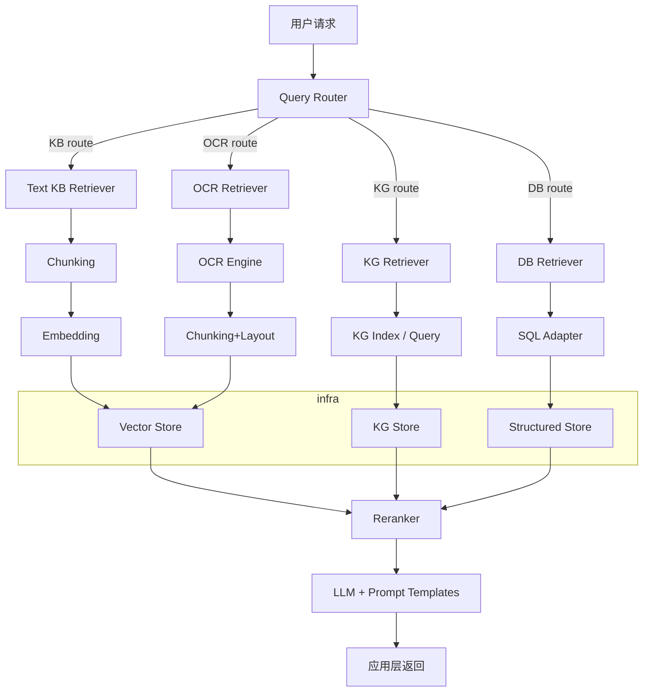

# 多源 RAG（KB / KG / DB / OCR）技术设计文档

作者: 自动生成
日期: 2026-05-19

## 概览

目标：构建一个支持多数据源（文本知识库 KB、知识图谱 KG、结构化数据库 DB、OCR 文档）的 RAG 平台，支持混合检索（向量+倒排），路由器选择最合适的数据源，最后使用 LLM 进行拼接、重排与生成结果。

设计原则：模块化、可扩展、可观测、安全（密钥不可存库）、可迭代交付。

## 架构图（Mermaid）



## 主要组件与职责

- Data Ingestor：负责从文件系统、API、数据库拉取数据，调用 OCR（可选），并输出标准化文档记录。
- Preprocessor：文本切分（`document/rag/shared/text_chunker.py`）、七步分块（`application/chunking/`）、表格解析。
- Embedder：统一调用 `config/llm.yml` 中的 `embedding_model_name` 生成向量。
- Vector Store：Chroma/Weaviate/Milvus 提供向量索引与相似度检索。
- Inverted Index：BM25 倒排（可用 ElasticSearch 或 Whoosh）用于混合检索。
- KG Store：Neo4j 或类似图数据库，提供基于实体/关系检索与子图抽取接口。
- DB Adapter：只读 SQL 接口（Postgres）并封装为短文本片段用于检索或直接作为工具调用。
- Router：短文本分类器或规则，决定先检索哪些源，支持并行检索与分段召回。
- Reranker：cross-encoder（如 qwen-rerank）对召回候选进行精排。
- LLM Composer：根据 `prompt.yml` 的模板拼接上下文并调用 `model` 层的大模型生成最终答案。
- Monitor & Audit：记录请求、候选来源、成本与质量指标。

## 数据模型与元数据约定

- Document record:
  - id: 唯一 id
  - source: 原始来源（file/db/kg）
  - source_id: 文件路径/表名/实体 id
  - page: 可选（OCR/多页文档）
  - bbox: 可选（OCR，保存位置信息）
  - chunk_text: 切块文本
  - embedding: 向量 (不直接存入 YAML/JSON 文件，存入向量库)
  - metadata: { title, author, ts, lang, tags }

元数据需要统一命名并在 Ingest 时进行归一化。

## 接口定义（REST 版本示例）

- POST /api/v1/query
  - 描述：接受用户查询，执行路由、检索、重排、LLM 合成并返回答案与来源。
  - 请求体：
    {
      "query": "string",
      "top_k": 5,
      "sources": ["kb","kg","db","ocr"],
      "mode": "answer|summarize|sql" // 可选
    }
  - 响应：
    {
      "answer": "...",
      "sources": [ {"source":"kb","id":"...","score":0.93}, ... ],
      "raw_candidates": [...]
    }

- POST /api/v1/ingest/file
  - 描述：上传文件并触发 Ingest pipeline（支持 pdf/docx/txt）。
  - 请求体：multipart file + metadata
  - 响应：{ job_id }

- GET /api/v1/ingest/status/{job_id}

- POST /api/v1/tool/sql
  - 描述：向结构化 DB 发起只读 SQL 查询（需严格权限控制）
  - 请求体：{ "sql": "SELECT ..." }
  - 响应：{ "rows": [...], "summary": "..." }

## 示例 API 调用（Python）

```python
import requests

resp = requests.post('http://localhost:8000/api/v1/query', json={
    'query': '某设备的保养周期是多少？',
    'top_k': 5,
    'sources': ['kb','db']
})
print(resp.json())
```

## Embedding 与索引策略

- Embedding：统一使用 `config/llm.yml` 的 `embedding_model_name`。对非文本（表格、图片 OCR 文本）先归一化为文本片段。
- 向量维度：保持一致或做跨空间映射。
- 索引：向量库负责 ANN 检索；同时为文本建立倒排索引用于快速精确匹配与短词查询。
- 混合检索融合：按权重合并向量分数与 BM25 分数。（参考配置 `hybrid_weights`）

## 路由与融合策略

- 路由器实现：基于规则（如包含实体名/SQL 关键词）或小型 intent 分类模型。
- 并行召回：对于被路由的多个源并行发起召回，请求超时控制与降级策略。
- 融合：收集所有候选，去重（基于文本相似度或相同 source_id），然后用 reranker 排序并截取 top-N。

## OCR 处理细节

- OCR 引擎：优先使用云 OCR（表格/结构化识别更佳），离线则用 Tesseract/PaddleOCR。
- 保留版面信息：页码、bbox，方便将片段回溯到原图并用于更精确的引用。
- 表格识别：识别表格并导出为 CSV/结构化行，再存入结构化 DB，同时也为表格文本生成 embedding。

## 知识图谱（KG）集成

- KG 构建：根据实体抽取器从文档中抽取三元组，或从现有源导入。
- KG 检索：基于图查询（Cypher）检索相关实体或子图，返回节点/关系摘要并可转换为文本候选。
- KG 与 RAG 协作模式：KG 提供事实约束与实体级证据，文本 KB 提供背景与解释。

## 安全与运维

- 密钥管理：`config/llm.yml` 仅占位；运行时从环境变量或 Vault 中读取。不要把明文 key 提交到 Git。
- 最小权限：DB 使用只读账号；对外 API 添加鉴权（JWT / API Key）。
- 监控：记录每次检索的来源分布、召回数量、Rerank 命中率与 LLM 调用成本。

## 评估与指标

- 离线指标：Precision@k, Recall@k, MRR, reranker accuracy
- 在线指标：用户满意度、人工标注准确率、平均延迟、每次查询成本

## 交付里程碑（示例）

1. M0（1-2 周）：搭建基础向量索引（KB）+ 最简单的 Query API 返回文档片段。
2. M1（2-4 周）：接入 OCR 的文档入库与向量化；支持文件上传流程。
3. M2（4-6 周）：接入结构化 DB（只读查询）并实现工具化调用。
4. M3（6-8 周）：接入 KG、实现路由器与重排并完成评估套件。

## 扩展与注意事项

- 成本控制：LLM 调用与 embedding 成本预估与限流策略。
- 数据同步：外部 DB/文件源需考虑增量更新与变更检测（md5, timestamp）。
- 合规：敏感数据脱敏与访问审计。

---

如果你想，我可以：

- 把这份文档拆成更细的实现任务并在 `docs/` 下生成一个任务清单；
- 为第一个里程碑（M0）生成一个可运行的最小原型代码示例（含 ingest + query API）；
- 或根据你偏好替换架构图为 PNG（我可以渲染并写入 `docs/`）。

请选择下一步。
